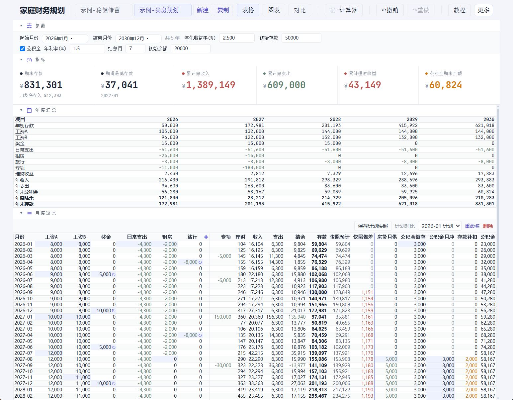
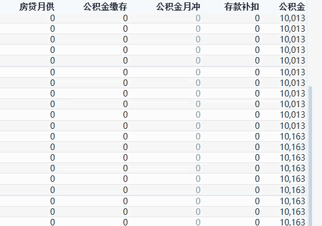
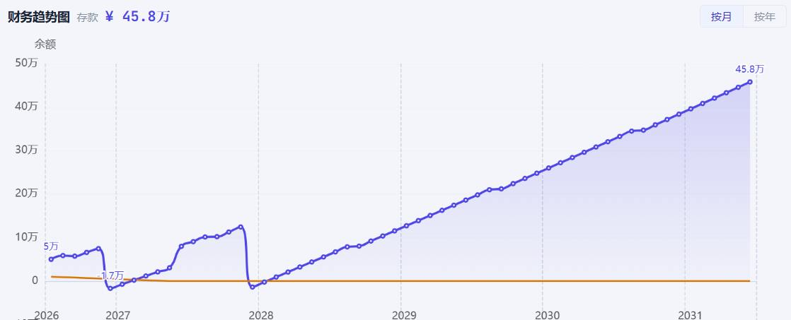
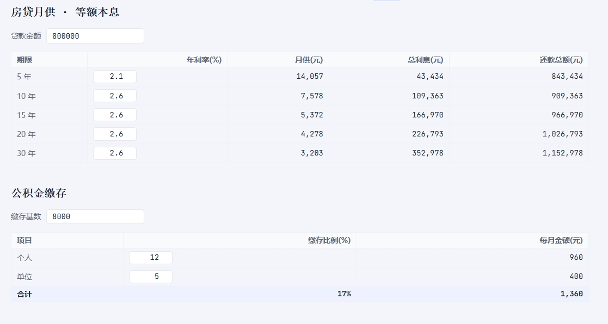

# 家庭财务规划器

[](./LICENSE)
[](https://vuejs.org/)
[](https://www.typescriptlang.org/)
[](https://vitejs.dev/)
[](https://vuejs.org/)
[](https://github.com/leytou/family-finance-webapp/actions/workflows/ci.yml)

> **知止而后有定，定而后能静，静而后能安，安而后能虑，虑而后能得。** ——《大学》
>
> 焦虑源于未知。把未来的账算清楚，心就安了。
>
> 一个面向未来的家庭财务规划工具：把收入、房贷、公积金、理财收益填进去，看见未来几年每个月手上有多少钱。

<p align="center">
  <strong>▶️ <a href="https://leytou.github.io/family-finance-webapp/">立即在线体验</a></strong>　·　无需安装、无需注册，数据只存你自己的浏览器
</p>



*增删项目、调整金额，整张表和图表实时重算——上手即懂：*


---

## 🧭 这是什么

它是一个面向未来的家庭财务**规划**工具，不是账本——往前算，不是往后记。

该不该买房？提前还款划算吗？攒几年能换辆车？孩子上学那年的存款够不够？
填进去算一下，比在 Excel 里对着格子发呆省事得多。

- **比 Excel**：内置公积金缴存/结息、房贷月供测算；多方案并排对比；点任意一个数字能看到它由哪些项目累加而来；改一个参数，整张表和图表自动重算。
- **比在线工具**：完全离线、不联网、不注册、不上传——你的财务数据不交给任何第三方。

---

## 🎯 适合谁用

- 🏠 正在纠结**买房 / 不买房**，想看清未来几年现金流的家庭
- 💰 已经有房贷，想算**提前还款、调整还款方式**划不划算
- 👶 在为**结婚、生孩子、孩子上学**等大额支出提前规划
- 🚗 想知道**攒几年能换车 / 换房 / 实现某个目标**
- 🔒 注重隐私，**不想把财务数据交给任何 App 和服务器**的人

**不太适合**：想自动同步银行账单、实时记账、多人协作的人——这是个规划工具，不是账本。

---

## 📸 功能一览

- **月度收支明细表**：按月列出每一笔收入、支出、投资收益、净储蓄和累计储蓄，列头随你添加的项目动态生成。
- **年度汇总报表**：按年聚合，一眼看清每年的收支构成和结余走向。
- **储蓄走势图表**：以折线图展示累计储蓄随时间的变化，开关公积金等参数后自动刷新。
- **专项事件列**：为结婚、购车、旅游等一次性大额收支单独建列，和日常固定收支分开管理。
- **多方案并行对比**：可以同时维护多份计划（如「买房版」「不买房版」），并排对比同一时间点的储蓄差异，帮你做取舍。
- **实际存款修正**：可在任意月份填入「实际手上的存款」，后续月份以真实值为起点重新滚动推算，让预估越来越准。
- **公积金与房贷计算器**：内置公积金缴存/结息、商业与公积金贷款月供测算，并能把公积金相关现金流接入主规划。
- **计划快照与偏差对比**：保存某一时刻的计划快照，之后修改了方案，可随时对比「现在 vs 快照」的偏差。
- **数据导入导出**：整份计划可导出为文件自行保存或换设备迁移，也能再次导入恢复。
- **撤销 / 重做**：编辑过程中支持撤销和重做，避免误操作。
- **动态列拖拽与显隐**：表格列可拖动调序、按需启用或隐藏，让界面只显示你关心的内容。
- **计算公式透视**：点击表格里的任意数字，可展开查看它的计算来源（由哪些项目、哪个月份累加而来）。

### 🎬 操作演示

|  |  |
| --- | --- |
| <br>**编辑月度流水** | <br>**编辑公积金参数**（缴存基数、比例、结息月份） |
| <br>**储蓄走势图**（累计存款随时间的变化曲线） | <br>**房贷月供与公积金缴存计算器** |

---

## 🚀 快速开始

三种使用方式，按需选择。

### 方式 1：在线网页 ✅ 建议

直接打开：**https://leytou.github.io/family-finance-webapp/**

> 🔒 **数据隐私**：即便用的是在线网页，所有财务数据也**只存在你自己的浏览器里**，不联网上传、无需注册账号——和离线版完全一样，数据绝不会离开你的设备。

### 方式 2：下载单文件网页（离线使用）

从 [Releases](https://github.com/Leytou/family-finance-webapp/releases) 下载 `index.html`，**双击即可在浏览器打开使用**，无需安装、无需联网。

- 一个文件就包含全部界面、计算和图表逻辑（基于 `vite-plugin-singlefile` 打包）。
- 方便离线保存、备份，或直接发给家人使用。
- 通过聊天工具发送时，建议先压缩成 zip，避免被当作网页文件拦截。

### 方式 3：本地构建

适合想阅读源码、二次开发，或自己打包的人。

**环境要求**：[Node.js](https://nodejs.org/) 18 或更高版本（建议 LTS）。

```bash
npm install        # 安装依赖（首次或拉取新代码后执行一次）
npm run dev        # 启动开发服务器（热更新，边改边看）
npm run build      # 打包生产版本，dist/ 下产出单文件 index.html
npm run test       # 运行测试
```

开发服务器启动后，按终端提示在浏览器打开本地地址（默认一般为 `http://localhost:5173`）即可使用。

---

## 🔒 数据隐私（重要）

本项目没有后端、没有账号、没有任何数据上报或第三方追踪。你的财务数据**完全只存储在你自己浏览器的 `localStorage` 中，绝不会上传到任何服务器**。

- 所有计算都在你的浏览器里完成，断网也能用。
- 清除浏览器数据 / 网站存储，等同于彻底删除你的全部规划数据。
- 想长期保存或换设备？随时用「导出」功能把数据存成文件自己保管。

如果对隐私有疑虑，可以直接阅读源码——数据读写逻辑完全开放、可自行审计。

---

## 🛠 技术栈

| 类别 | 技术 |
| --- | --- |
| 框架 | [Vue 3](https://vuejs.org/)（Composition API） |
| 语言 | [TypeScript](https://www.typescriptlang.org/) |
| 构建 | [Vite](https://vitejs.dev/) |
| 样式 | [UnoCSS](https://unocss.dev/)（原子化 CSS） |
| 图表 | [ECharts](https://echarts.apache.org/) |
| 测试 | [Vitest](https://vitest.dev/) |

---

## 📄 开源协议

本项目基于 [MIT License](./LICENSE) 开源，欢迎自由使用、修改和分享。

如果这个工具帮到了你，欢迎点个 ⭐ Star，让更多有需要的人看到它。
